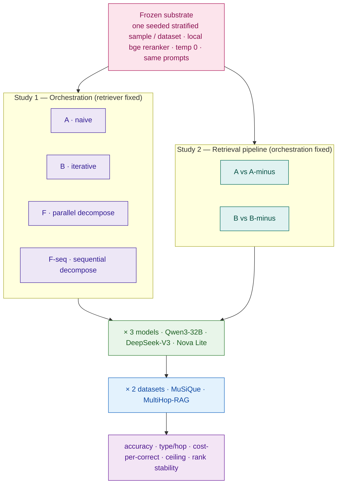
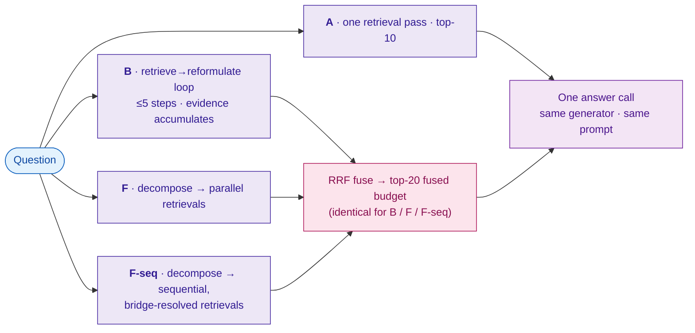
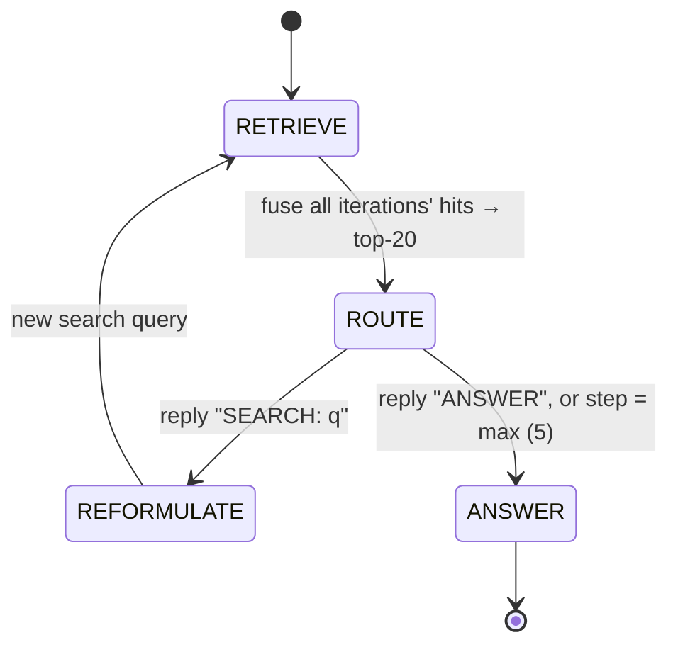
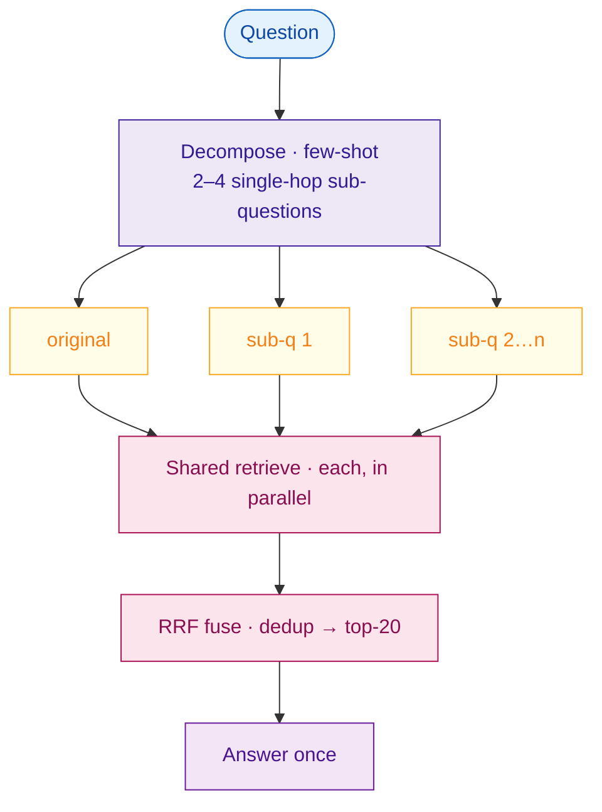
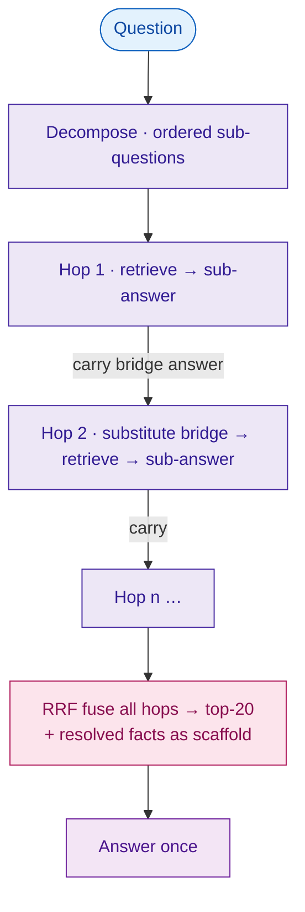
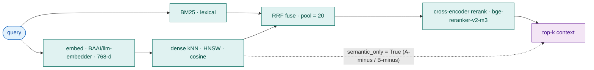

# Chapter 3 — Methodology

> **Draft status & how to use this file.** A full draft assembled from the implemented system
> (`api/src/`), the claim audit (`DISSERTATION_AUDIT.md`, esp. §5c), and the verified literature base
> (`RELATED_WORK.md`). It describes work that exists in the codebase; it is *not* a final hand-in.
> Before submitting: (a) rewrite in your own voice — examiners mark *your* understanding; (b) resolve
> every `[CONFIRM]`/`[PLACEHOLDER]`; (c) verify citations against `RELATED_WORK.md §6`. Markers left
> deliberately: exact model IDs/versions, final sample sizes *N*, and hardware (P3) are environment
> facts only you can fill.
>
> **Figures** are Mermaid diagrams (render on GitHub / VS Code). For Word/LaTeX, export to PNG/SVG via
> mermaid.live or `mmdc` and swap the code block for the image.

---

## 3.1 Research design

This study is a **controlled computational experiment**. Its purpose is not to find the single best
retrieval-augmented generation (RAG) pipeline, but to *isolate the effect of two design choices* —
the **orchestration strategy** (the control logic that decides how many retrieval calls to issue and
how to phrase them) and the **retrieval pipeline** (how candidate evidence is found and ranked) — on
answer quality, cost, and latency, while holding every other component fixed.

The design comprises **two studies sharing one frozen substrate**:

- **Study 1 — Orchestration.** The retriever is held constant; four orchestration strategies (A, B,
  F, F-seq) are evaluated under three language models over two datasets. Because the retriever, the
  corpus, the prompts, and the evaluation harness are identical across every cell, any measured
  difference is attributable to orchestration (and model), not to confounded engineering choices.
- **Study 2 — Retrieval pipeline.** Each orchestration is also run over a deliberately weakened,
  dense-kNN-only retriever (the "-minus" twins), giving a full **4×2 retrieval×orchestration
  factorial** (A/B/F/F-seq × hybrid/dense-only). This isolates the contribution of the retrieval
  pipeline and, crucially, its *interaction* with orchestration and dataset.

This single-variable framing — moving one factor at a time against a fixed substrate — is the
methodological core of the dissertation and the basis of its originality claim (§3.2).

*Figure 3.1 — Two studies on one frozen substrate: Study 1 varies orchestration with the retriever fixed; Study 2 varies the retriever with orchestration fixed; both run across three models and two datasets.*

The experiment is **quantitative and reproducible by construction**. Every strategy implements one
Python interface, is executed by one deterministic runner, and is persisted to a relational database
with a provenance fingerprint on every experiment (§3.8). Determinism is enforced wherever a language
model is invoked (`temperature = 0`), so a re-run of the same configuration against the same corpus
build reproduces the same answers.

## 3.2 The controlled-comparison framework

**Study 1 — the orchestration arm.** The independent variable is *orchestration*, and the framework
is designed so the four systems vary only in it. Systems A, B, F and F-seq share the same retriever
(§3.4), the same generator and answer prompt, and the same evidence-fusion mechanism. The three
*multi-query* strategies — B, F, F-seq — additionally share an identical **answer-context budget of
twenty fused chunks** (`fused_answer_top_k = 20`), so they differ in exactly one respect: *how the
queries that fill that budget are produced*.

- **A** answers over a single retrieval pass (its top-10) — the standard-RAG baseline and the
  degenerate case the others reduce to when no extra queries are warranted.
- **B** fuses the results of several *sequential* retrievals, each query conditioned on evidence
  already gathered.
- **F** fuses the results of several *parallel* retrievals, the queries produced up front by
  decomposing the question.
- **F-seq** decomposes like F, but resolves the sub-questions *sequentially*, substituting each
  resolved bridge answer into the next sub-question's retrieval query.

*Figure 3.2 — The controlled single-variable orchestration comparison. The three multi-query strategies (B, F, F-seq) share the retriever, the generator and an identical 20-chunk fused budget; only the query-production logic (purple) differs. System A is the single-pass baseline.*

Because retriever, generator, prompt and budget are constant across the multi-query systems, the
**B ↔ F ↔ F-seq** contrast is the purest in the study: the systems differ only in *how the extra
queries are produced* — sequential conditioned reformulation (B), parallel upfront decomposition (F),
or sequential self-ask decomposition (F-seq). This is the explicit answer to **Gap 1** (confounded RAG
evaluations): published MultiHop-RAG results mix chunkers, embedders and language models with no
leaderboard to normalise them (`RELATED_WORK.md §2`), whereas this design fixes the substrate and
moves one lever at a time.

Two single-variable contrasts carry the orchestration findings: **F vs F-seq** isolates *parallel
versus sequential* decomposition (self-ask / least-to-most lineage — Press et al. 2023; Zhou et al.
2023), and **F-seq vs B** isolates *pre-decomposed self-ask versus free-form iterative reformulation*.
A note on scope: System A answers over its single-pass top-10 rather than a padded 20, so A↔(B/F/F-seq)
comparisons combine the orchestration change with a 10→20 budget change; the clean
budget-held-constant comparison is *among* the multi-query systems and within each Study-2 pair (below).
The 20-chunk budget itself was fixed after a budget-sensitivity ablation showed the optimum is
per-strategy (iterative accumulation prefers a narrower budget, fan-out a wider one); a single constant
was adopted for comparability (`DISSERTATION_AUDIT.md §5c`).

**Study 2 — the retrieval arm.** The second arm holds orchestration constant and varies the retriever.
Every system has a dense-kNN-only twin — A-minus, B-minus, F-minus, F-seq-minus — byte-for-byte
identical to its parent except that retrieval is restricted to **dense nearest-neighbour search only**:
no BM25 lexical matching, no reciprocal-rank fusion, no cross-encoder rerank (a per-call
`retrieve(semantic_only=True)` switch, §3.4). Each twin is budget-matched to its parent, so each
**X↔X-minus** delta isolates the retrieval-pipeline contribution exactly *for that orchestration*. Run
across both datasets, the four deltas test whether the pipeline's value is **consistent across
orchestrations** and **dependent on the dataset** — the study's novel finding (§4.3). This complete
factorial replaces the earlier F-tuned "stacked engineering ceiling": rather than confound several
levers in one system, the retriever is a single, cleanly-manipulated factor crossed with every
orchestration.

## 3.3 The orchestration strategies and their retrieval-ablated twins

**Nomenclature.** Systems are referred to by their short code in tables and figures and by their
descriptive name in prose; the two are used interchangeably and the code is retained in parentheses
after each name. The codes are also the internal identifiers stored in the database (`runs.system`),
kept stable for comparability with historical runs.

| Code | Name | Orchestration | Retriever |
|---|---|---|---|
| **A** | Single-pass RAG | naive — one retrieval, one answer | hybrid (BM25+dense+rerank) |
| **A-minus** | Single-pass RAG (dense-only) | naive | dense-kNN only |
| **B** | Iterative RAG | iterative reformulation loop (≤5) | hybrid |
| **B-minus** | Iterative RAG (dense-only) | iterative | dense-kNN only |
| **F** | Parallel decomposition | decompose → retrieve sub-questions in parallel | hybrid |
| **F-minus** | Parallel decomposition (dense-only) | parallel decompose | dense-kNN only |
| **F-seq** | Sequential decomposition (Self-Ask) | decompose → resolve hops one at a time | hybrid |
| **F-seq-minus** | Sequential decomposition (dense-only) | sequential decompose | dense-kNN only |

*Table 3.1 — System nomenclature: a full 4×2 retrieval×orchestration factorial. The orchestration axis
(A/B/F/F-seq) is Study 1; the dense-only "-minus" twin of each (Study 2) ablates the retriever. "Hybrid"
is the default and is left implicit in most tables; only the dense-only rows are tagged.*

All systems implement a single `answer(query) -> RunResult` protocol (`systems/base.py`), so the
runner treats them interchangeably and only the control logic varies.

**A — naive** (`systems/system_a.py`). A single retrieval followed by a single generation: A retrieves
ten chunks for the question and answers over them in one model call. The "standard RAG" baseline every
comparable paper measures against (`RELATED_WORK.md §4`).

**B — iterative agent** (`systems/system_b.py`). A bounded reformulation loop implemented in LangGraph.
Each iteration is a single **free-text** routing call that replies in one of two forms — `ANSWER`
(synthesise now) or `SEARCH: <query>` (the next search query) — parsed by a simple keyword rule; when
the loop answers, a dedicated call with the shared answer prompt produces the final response. This
free-text routing **replaced an earlier typed `instructor` schema** that parse-failed on the
non-Anthropic models (it emitted the decision as prose, not JSON); the keyword form is robust across
all three models and roughly halves B's model calls. The loop terminates on an `ANSWER` action or at a
hard budget of five steps (`max_agent_steps`). Evidence **accumulates across iterations** (IRCoT-style
union): routing and answering operate on the reciprocal-rank fusion of all iterations' hits, truncated
to the shared twenty-chunk budget, so a chunk found at step one remains visible at step five. B's
closest anchors are IRCoT and Iter-RetGen, from which it differs by reformulating a *search query*
(not a chain-of-thought sentence, not a full answer) and by running on cost-efficient models.

*Figure 3.3 — System B's loop: a free-text ROUTE reply (`ANSWER` / `SEARCH: q`) drives either another retrieval or the final answer, bounded at five steps; evidence accumulates via RRF across iterations.*

**F — parallel decomposition** (`systems/system_f.py`). A single model call decomposes the question
into two-to-four single-hop sub-questions (a few-shot `Decomposition` schema). F retrieves for the
original question *and* each sub-question over the same retriever, reciprocal-rank-fuses the lists
(deduplicated by chunk), and answers once over the fused top-twenty. A single-hop question yields an
empty decomposition, so F degenerates to A. F mirrors the decomposition-plus-reranker recipe of Ammann,
Golde & Akbik (2025) but is **not a replication** (hybrid not dense-only retriever; per-sub-question
rerank then fusion; `temperature = 0`; cost-efficient models — `RELATED_WORK.md §4`).

*Figure 3.4 — System F: parallel fan-out over the question plus its sub-questions, fused to the 20-chunk budget before one answer call.*

**F-seq — sequential self-ask decomposition** (`systems/system_fseq.py`). F-seq shares F's decomposer
and answer prompt but resolves the ordered sub-questions **one hop at a time**. For each sub-question it
substitutes the already-resolved bridge answers into the retrieval query (so a descriptive reference
like "the spouse of *that director*" becomes the real name — F's *dead-bridge* weakness), retrieves,
then a small model call answers that sub-question from its own context. Resolved facts carry forward; a
failed hop answers `UNKNOWN` and is not carried (so it cannot poison the next query). The final answer
is generated over the RRF-fused union of every hop, with the resolved intermediate facts supplied as a
reasoning scaffold. F-seq is the sequential counterpart that makes the parallel-versus-sequential
decomposition contrast (vs F) a clean single-variable comparison.

*Figure 3.5 — System F-seq: ordered hops, each substituting the prior hop's resolved answer into its retrieval query, fused to the 20-chunk budget for one final answer.*

**The "-minus" twins — the retrieval-ablated systems.** Each orchestration has a dense-kNN-only twin —
A-minus, B-minus, F-minus, F-seq-minus — identical to its parent except that retrieval is restricted to
dense nearest-neighbour search (§3.4). They are not new orchestrations: each runs the *same* control
logic over a deliberately weakened retriever, completing a full 4×2 retrieval×orchestration factorial.
This lets Study 2 test whether the retrieval-pipeline effect is *consistent across orchestrations* (does
dense-only help/hurt the same way under naive, iterative and decomposition control?) — not just for the
naive and iterative cases. It is what makes the dataset-dependent retriever finding (§4.3) robust rather
than a property of one orchestration.

Both F and F-seq **degrade gracefully**: a decomposition that fails to parse yields no sub-questions
rather than a crash, so the system falls back to A's behaviour. This fallback is not merely defensive —
it is the mechanism behind a model-robustness finding (§3.5, §4.6).

## 3.4 The shared retrieval substrate

The retriever is the principal experimental control: holding it constant across Study 1 is what
licenses attributing differences to orchestration. Every system calls one entry point,
`retrieval/retrieve.py:retrieve`, which performs **hybrid retrieval** — lexical BM25 and dense
k-nearest-neighbour search run in parallel, fused by reciprocal-rank fusion to a first-stage pool, then
re-ranked by a cross-encoder to the final top-*k*. Queries are embedded with `BAAI/llm-embedder` (768
dimensions); the corpus is indexed in OpenSearch (HNSW, Lucene, cosine); the first-stage pool is twenty
(`retrieval_pool`); and the cross-encoder is the local `BAAI/bge-reranker-v2-m3` (chosen over a hosted
reranker for the final matrix: it is free, reproducible, and removes an external dependency). Multi-list
fusion for B, F and F-seq uses a client-side reciprocal-rank fusion (`rrf_fuse`) independent of
OpenSearch's absolute score scale.

*Figure 3.6 — The shared hybrid substrate (`retrieve`): BM25 + dense, RRF over a pool of 20, then cross-encoder rerank. The dashed path is the Study-2 ablation: `semantic_only=True` short-circuits to dense-kNN alone, bypassing BM25, fusion and rerank.*

The **semantic-only ablation** is the single switch that defines A-minus and B-minus: with
`semantic_only=True`, `retrieve` returns the raw dense-kNN top-*k*, skipping BM25, RRF and the
reranker. Because it is a per-call argument (not a global flag), the ablated and full-pipeline systems
run side by side in one experiment over the identical sample — the cleanest possible retriever
comparison.

A small but load-bearing detail is **context formatting** (`format_context`): each chunk is rendered
with its source and title metadata, not just text. This closes a benchmark-specific gap in MultiHop-RAG
(comparison questions name a publisher the chunk text does not expose). Because the formatting is
shared, it cannot bias one strategy over another.

## 3.5 Models and inference

The three models are **heterogeneous cost-efficient models spanning a capability gradient** rather than
a capability frontier: Nova Lite (small/weak) < Qwen3-32B (mid) < DeepSeek-V3 (large MoE, near-frontier
capability but cheap to serve) `[CONFIRM final model IDs/versions]`. All are served through AWS Bedrock
and invoked via the **LiteLLM SDK** (not a proxy; the single-user setting makes the SDK sufficient).
Inference is deterministic (`temperature = 0`). Per-call cost is read from the provider response
(`response._hidden_params["response_cost"]`), with a per-token fallback, and persisted per run so the
cost axis (§3.7) rests on billed figures, not estimates. As the embedder, reranker and faithfulness
model run locally on CPU at no charge, the recorded `cost_usd` is the full variable cost.

Two scoping constraints follow from this panel. First, the cross-model comparison (RQ3/RQ4) is framed
as **rank stability across a cost-efficient capability gradient**, not an absolute "model strength"
axis; frontier proprietary models are out of scope by design — the contribution is the cost-constrained
regime (audit W6). Second, the panel surfaces a **model-robustness result**: Nova Lite cannot reliably
execute the decomposition systems — its structured-output decoder parse-fails, so F and F-seq fall back
to no sub-questions and degrade to naive retrieval (a pilot showed ~1.1 retrievals on Nova versus
3.5–3.7 on Qwen3/DeepSeek). F and F-seq are therefore reported on Qwen3 and DeepSeek-V3 only, and the
failure is itself a finding: *decomposition orchestration presupposes reliable structured-output
generation, whereas iterative free-text reformulation (B) is the more model-robust multi-hop strategy*
(§4.6).

## 3.6 Datasets and sampling

Two multi-hop datasets are used, chosen so their *retrieval characteristics differ* — which turns out
to be central to Study 2.

**MultiHop-RAG** (Tang & Yang 2024, COLM; `yixuantt/MultiHopRAG`) supplies retrieval and
answer-correctness evaluation over a **news corpus**: 2,556 queries in four types — Inference (816),
Comparison (856), Temporal (583) and **Null** (301) — with evidence across two-to-four documents.
Chunks are 256-token passages; gold evidence is keyed by article URL, and retrieved passages are mapped
back to their parent article when scoring retrieval. The **Null** type (unanswerable questions) is
retained throughout sampling, stratification and refusal-equivalence scoring, because a strategy's
tendency to over-answer is itself a finding.

**MuSiQue** (Trivedi et al. 2022, TACL; `dgslibisey/MuSiQue`) is an **anti-shortcut** multi-hop
dataset: its 2–4-hop questions are composed so that answering genuinely requires combining evidence
across paragraphs. Critically, its hard distractors are **mined with BM25, with intermediate answers
masked** (`RELATED_WORK.md §8`) — i.e. the distractors are adversarially confusable to *lexical*
retrieval by construction. Each question ships ~20 candidate paragraphs; the ingested questions'
paragraphs are pooled into one corpus (keyed `<question_id>::p<idx>`) in a separate index
(`rag-chunks-musique`), so retrieval is scoped to MuSiQue and each query competes against the full
pooled set of distractors. Gold = the supporting paragraphs; hop count is stored as the question type
(`2hop`/`3hop`/`4hop`) for stratification. A data-integrity check confirmed the corpus is complete (all
gold paragraphs present and indexed; `DISSERTATION_AUDIT.md §5c`). This study evaluates MuSiQue in a
**pooled-distractor retrieval setting** — harder than the native 20-paragraph distractor setting, easier
than open-domain Wikipedia; absolute scores are therefore not directly comparable to either, but the
retriever is held constant across systems, so the within-study comparisons are valid.

The choice of two datasets with opposite lexical characteristics — news (lexically honest) versus
MuSiQue (lexically adversarial) — is deliberate: it is what makes the dataset-dependent retriever
finding (§4.3) possible.

Query selection is a **single seeded, stratified sample per dataset** (stratified by question type /
hop count), with the exact query identifiers recorded in the experiment's configuration snapshot and
**reused across all cells** so every system answers the same questions. The final sample sizes are
MuSiQue *N* = `[PLACEHOLDER]` (up to the 150 ingested) and MultiHop-RAG *N* = `[PLACEHOLDER]`
`[CONFIRM seed]`. (Earlier pilot runs used *N* = 50, which exhibited single-digit-query noise; the final
matrix raises *N* to reduce it.)

> **Note — RAGTruth removed.** An earlier design used RAGTruth to calibrate the faithfulness threshold.
> RAGTruth has been removed as a dataset; the HHEM threshold is now a fixed configuration value (§3.7),
> not fit from a calibration split.

## 3.7 Metrics and scoring

Correctness is reported through a layered set with a single deterministic **primary** and lexical
secondaries, so no finding rests on one possibly-idiosyncratic measure.

**Primary — containment accuracy.** `contains_match` asks whether the normalised gold answer appears
within the normalised response — matching the MultiHop-RAG paper's treatment of short factoid answers.
For MuSiQue, which ships answer aliases, the runner uses `answer_match`: containment against gold *plus
aliases*, with bidirectional whole-word matching so a correct-but-terser answer ("Paraguay" vs
"Alfredo Stroessner's Paraguay") still scores. Two disclosures: this study's containment is **stricter**
than the benchmark's official word-set-intersection scorer (verified in `qa_evaluate.py`), so reported
accuracy is conservative; and the matcher adds post-marker extraction, refusal-equivalence (a standard
refusal scores correct on Null questions), unicode-dash normalisation (so "1943-1992" matches
"1943–1992"), and entity-suffix tolerance — all disclosed rather than silently applied.

**Secondaries.** `exact_match` is normalised full-string equality (slightly stricter than SQuAD EM — it
does not strip *a/an/the*; disclosed). `token_f1` is SQuAD-style token-overlap F1 over the post-marker
answer, comparable to the answer-F1 decomposition papers report. A CRAG LLM-as-judge is implemented
(`evaluation/judge.py`, the four-way human-rubric weights 1/0.5/0/−1) but is treated as an optional
secondary and is **omitted from the final matrix by design** — the deterministic primary plus lexical
secondaries are the headline metrics, and dropping the judge also removes a non-deterministic, costed
dependency.

**Retrieval quality** uses the benchmark's own set — Hits@4, Hits@10, MRR@10, MAP@10 — plus precision
and recall at five.

**Faithfulness** (hallucination / grounding) is **out of scope for the final evaluation.** An earlier
design computed a Vectara-HHEM faithfulness score per run; that subsystem was removed, so the final
matrix does not report faithfulness. The correctness claims rest on the deterministic containment
primary and the lexical secondaries above; faithfulness measurement is noted as future work. *(The
`runs.hhem_score`/`flagged` and `metrics.avg_faithfulness`/`pct_flagged` columns remain in the schema
but are unpopulated.)*

**Cost and efficiency.** Each run records billed dollar cost, token counts, latency and trajectory
length. Two aggregates matter most: `total_cost_usd` and **`cost_per_correct`** — dollars per correct
answer, which has no precedent in the surveyed literature and is presented as a contribution (Gap 2).
`pct_failed` records crashes; the **policy is that a crash counts as wrong** (failed runs stay in the
accuracy denominator), with the rate surfaced rather than hidden.

## 3.8 Reproducibility, provenance and ethics

*Figure 3.7 — The reproducible, idempotent pipeline. Each stage re-runs safely; the matrix runs once on a frozen commit, one sample per dataset and one image build (protocol P1/P2).*

Reproducibility is a hard requirement. The whole stack is Dockerised (OpenSearch, Postgres, Phoenix,
application), and ingest, indexing, experiment execution and metric computation are **idempotent and
resumable**: re-running a command resumes where it stopped, guaranteed by a uniqueness constraint on
`(experiment, system, query)` so an interrupted matrix never double-charges. Each experiment persists a
**provenance fingerprint**: the git commit SHA, the LiteLLM version (so every cost figure is
attributable to a pricing build), reranker and retrieval settings, the HHEM threshold, and a
per-dataset corpus fingerprint (chunk count, granularity). For the final matrix the protocol is to wipe,
re-ingest and re-index once, freeze the SHA, and run every configuration back-to-back on a single image
build against the same indices, so the runs are internally consistent. Hardware is recorded
`[PLACEHOLDER: CPU/RAM — P3]` because the embedder, reranker and faithfulness model are CPU-bound and
shape latency. Every model call is traced to Phoenix via OpenTelemetry.

Ethically the study is low-risk: it uses public research datasets, contains no personal or sensitive
data, and makes only metered, authorised commercial-API calls. The principal threats to validity are
stated plainly: the cost-efficient model panel bounds the generality of cross-model claims (§3.5);
cross-provider latency carries a serving-infrastructure confound and is scoped to within-model
comparisons (§3.7); the A↔(B/F/F-seq) budget asymmetry means the clean budget-constant comparisons are
*among* the multi-query systems and within each Study-2 pair (§3.2); and the MuSiQue retriever finding
is, in part, a consequence of that benchmark's BM25-mined distractor construction — stated as such
rather than over-generalised (§4.3).
