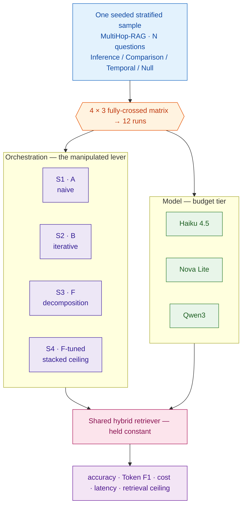
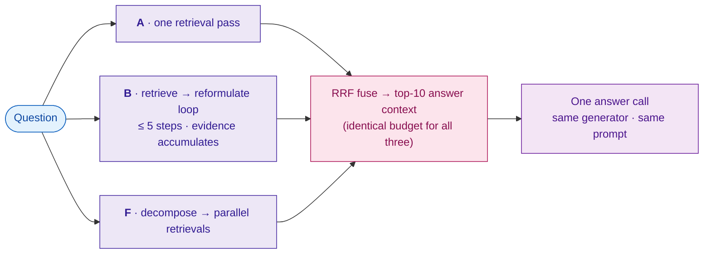
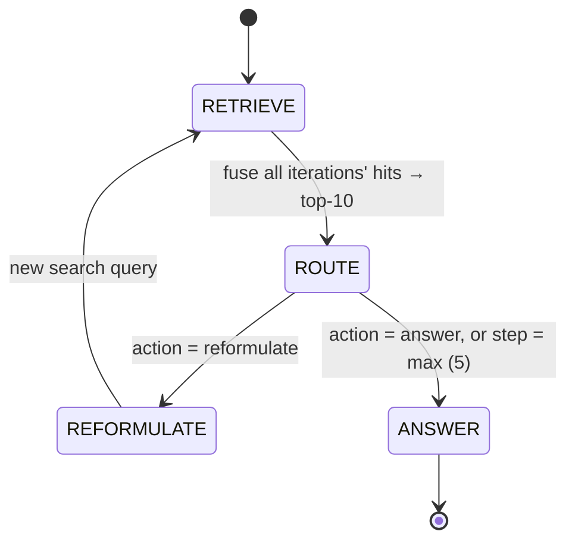
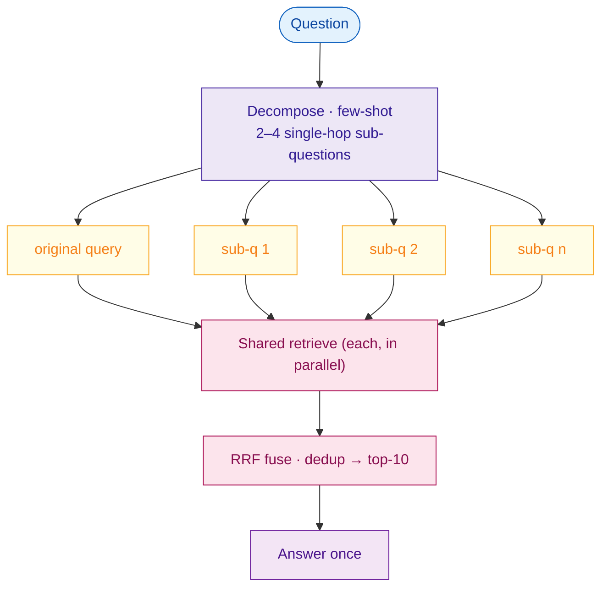
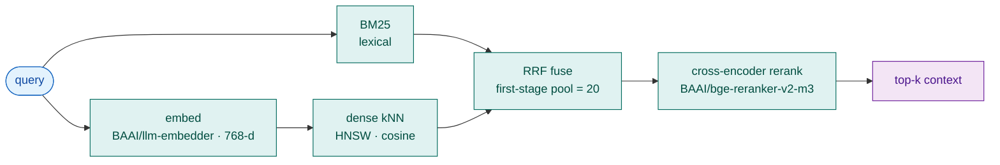
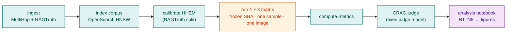

# Chapter 3 — Methodology

> **Draft status & how to use this file.** This is a full draft (~2,500 words) assembled from the
> implemented system (`api/src/`), the claim audit (`DISSERTATION_AUDIT.md`), and the verified
> literature base (`RELATED_WORK.md`). It describes work that exists in the codebase; it is *not*
> a final hand-in. Before submitting: (a) rewrite in your own voice — examiners mark *your*
> understanding; (b) resolve every `[CONFIRM]`/`[PLACEHOLDER]` marker; (c) verify each citation
> against the cautions in `RELATED_WORK.md §6`. Markers left deliberately: exact model IDs/versions,
> final sample size *N*, and hardware (P3) are environment facts only you can fill.
>
> **Figures** are Mermaid diagrams — they render inline on GitHub and in VS Code (Markdown Preview
> Mermaid Support). For a Word/LaTeX submission, export each to PNG/SVG via mermaid.live or the
> Mermaid CLI (`mmdc`) and swap the code block for the image.

---

## 3.1 Research design

This study is a **controlled computational experiment**. Its purpose is not to find the single best
retrieval-augmented generation (RAG) pipeline, but to *isolate the effect of orchestration strategy*
— the control logic that decides how many retrieval calls to issue and how to phrase them — on
answer quality, cost, and latency, while holding every other component of the pipeline fixed.

The design is a fully-crossed **4 × 3 matrix**: four orchestration strategies (S1–S4) evaluated under
three language models, giving twelve system–model configurations, each run over one shared,
stratified question sample. Because the retriever, the corpus, the answer-context budget, the
prompts, and the evaluation harness are identical across every cell of the matrix, any measured
difference between cells is attributable to the two manipulated factors — orchestration and model —
rather than to confounded engineering choices. This single-variable framing is the methodological
core of the dissertation and the basis of its originality claim (§3.2).

*Figure 3.1 — Experimental design: one fixed sample crossed with four strategies and three models, all sharing a single frozen retriever.*

The experiment is **quantitative and reproducible by construction**. All four strategies are
implemented behind one Python interface, executed by one deterministic runner, and persisted to a
relational database with a provenance fingerprint attached to every experiment (§3.8). Determinism
is enforced wherever a language model is invoked (`temperature = 0`), so a re-run of the same
configuration against the same corpus build reproduces the same answers.

## 3.2 The controlled-comparison framework

The independent variable of interest is *orchestration*, and the framework is designed so that three
of the four systems vary **only** in orchestration. Systems A, B and F share the same retriever
(§3.4), the same generator and prompt, and — critically — the same **answer-context budget of ten
chunks**. They differ in exactly one respect: *how those ten chunks are selected*.

- **A** selects its ten chunks in a single retrieval pass.
- **B** selects them by fusing the results of several sequential retrievals, where each query is
  conditioned on evidence already gathered.
- **F** selects them by fusing the results of several parallel retrievals, where the queries are
  produced up front by decomposing the question.

*Figure 3.2 — The controlled single-variable comparison. Only the middle (purple) stage differs across A, B and F; the inputs, the ten-chunk budget (pink), and the generation step (lavender) are held identical.*

Because retriever, generator, prompt, and budget are constant, the A↔B↔F contrast is — to use the
audit's phrasing — "the purest possible comparison": B and F differ from A and from each other only
in *how the extra queries are produced* (sequential conditioned reformulation versus parallel upfront
decomposition). This is the controlled single-variable arm of the study and the explicit answer to
**Gap 1** (confounded RAG evaluations): published MultiHop-RAG results mix chunkers, embedders and
language models, and no leaderboard exists to normalise them (`RELATED_WORK.md §2`), whereas this
design fixes the substrate and moves one lever at a time.

The fourth system, **F-tuned (S4)**, is deliberately *not* a clean single-variable arm. It stacks
several engineering levers on top of F — weighted reciprocal-rank fusion, source-metadata fan-out,
reserved context slots, and a chain-of-thought answer prompt — and in doing so it also changes the
prompt and the internal context composition. It is therefore presented honestly as a **stacked
engineering ceiling**: an estimate of how far the decomposition family can be pushed with realistic
tuning, not as a controlled measurement of any one lever. Keeping F-tuned rhetorically separate from
the A/B/F arm preserves the integrity of the Gap-1 confound claim.

## 3.3 The four orchestration strategies (S1–S4)

All four strategies implement a single `answer(query) -> RunResult` protocol (`systems/base.py`),
so the runner treats them interchangeably and the only thing that varies between them is the control
logic itself.

**S1 — System A (naive).** A single retrieval followed by a single generation. A retrieves ten
chunks for the original question and answers over them in one language-model call. It is the
"standard RAG" baseline that every comparable paper measures against (`RELATED_WORK.md §4`) and the
degenerate case to which B and F reduce when no additional queries are warranted.

**S2 — System B (iterative agent).** A bounded reformulation loop implemented in LangGraph
(`systems/system_b.py`). Each iteration is *two* language-model calls: a one-field typed routing
decision (`RouteDecision`, `action ∈ {reformulate, answer}`, produced through the `instructor`
library so it cannot parse-fail), followed by a free-text call that writes either the reformulated
search query or the final answer. Splitting the decision from the generation was a deliberate
robustness choice — a single multi-field schema choked on the non-Anthropic models, whereas the
one-field route survives them. The loop terminates on an `answer` action or at a hard budget of
five steps (`max_agent_steps`). Crucially, evidence **accumulates across iterations** in an
IRCoT-style union: every routing, reformulation and answer step operates on the reciprocal-rank
fusion of all iterations' hits, truncated to the shared ten-chunk budget — so a chunk found at step
one remains visible at step three. B's closest literature anchors are IRCoT and Iter-RetGen, from
which it differs by reformulating a *search query* (not a chain-of-thought sentence, not a full
answer), by its typed route step, and by running on a budget commercial model rather than GPT-3.5
or PaLM.

*Figure 3.3 — System B's two-call state machine: each loop is a typed ROUTE decision followed by either a reformulation (back to RETRIEVE) or the final ANSWER, bounded at five steps.*

**S3 — System F (query decomposition).** A single language-model call decomposes the question into
two-to-four single-hop sub-questions (a few-shot `Decomposition` schema, shared with F-tuned). F then
retrieves for the original question *and* each sub-question over the same retriever as A and B,
reciprocal-rank-fuses the resulting lists (deduplicated by chunk), and answers once over the fused
top ten. A single-hop question yields an empty decomposition, so F degenerates exactly to A's
retrieval and context. F mirrors the decomposition-plus-reranker recipe of Ammann, Golde & Akbik
(2025) but is **not a replication**: it uses a hybrid rather than dense-only retriever, per-sub-question
rerank then fusion rather than a single merged-pool rerank, `temperature = 0` rather than 0.8, and a
budget model rather than Qwen-32B (`RELATED_WORK.md §4`).

*Figure 3.4 — System F: parallel fan-out over the original question plus its sub-questions, fused back to the same ten-chunk budget before a single answer call.*

**S4 — System F-tuned (stacked levers).** F plus four additions (`systems/system_f_tuned.py`):
weighted reciprocal-rank fusion that privileges the original query (2.0×) and source-filtered
retrievals (1.5×) over plain sub-questions (1.0×); a source-metadata fan-out that issues additional
retrievals filtered to the publishers named in the question; reserved slots that guarantee
representation from the original query in the final context; and a chain-of-thought answer prompt. As
noted in §3.2 it is the engineering-ceiling arm. Its residual deltas versus F are the weighted
fusion, the source fan-out, the reserved slots and the CoT prompt — the few-shot decomposer is shared
and therefore not a delta.

Both F and F-tuned degrade gracefully: a decomposition that fails to parse (a known failure mode on
the non-Anthropic models, which emit JSON followed by trailing prose) yields no sub-questions rather
than a crash, so the system falls back to A's behaviour instead of recording a null run.

## 3.4 The shared retrieval substrate

The retriever is the principal experimental control: holding it constant across all four strategies
is what licenses attributing differences to orchestration. Every system calls one entry point,
`retrieval/retrieve.py:retrieve`, which performs **hybrid retrieval** — lexical BM25 and dense
k-nearest-neighbour search run in parallel, fused by reciprocal-rank fusion, and then re-ranked by a
cross-encoder to the final top-*k*. Queries are embedded with `BAAI/llm-embedder` (768 dimensions);
the corpus is indexed in OpenSearch using HNSW (Lucene engine, cosine similarity); the first-stage
pool size before reranking is twenty (`retrieval_pool`); and the cross-encoder is
`BAAI/bge-reranker-v2-m3`. Multi-list fusion for B (across iterations) and F (across sub-questions)
uses a client-side reciprocal-rank fusion (`rrf_fuse`) that is independent of OpenSearch's absolute
score scale, so the fusion behaves identically regardless of how the underlying scores are
distributed. The single-list case is the identity, so A's lone retrieval also returns ten chunks —
which is why the ten-chunk answer-context budget holds uniformly across A, B and F.

*Figure 3.5 — The shared hybrid retrieval substrate (`retrieval/retrieve.py:retrieve`), identical for all four strategies: parallel BM25 + dense search, RRF fusion over a pool of 20, then cross-encoder rerank.*

A small but load-bearing detail of the substrate is **context formatting** (`format_context`): each
chunk is rendered with its source and title metadata, not just its text. This closes a
benchmark-specific gap in MultiHop-RAG, where comparison questions name a publisher ("the Hacker News
article on …") that the chunk text alone does not expose; without surfacing the `source` field these
questions fail across every system even when the correct chunk is retrieved. Because the formatting is
shared, it cannot bias one strategy over another.

## 3.5 Models and inference

The three models span a **budget commercial tier** rather than a capability frontier:
Claude Haiku 4.5, Amazon Nova Lite, and Qwen3 `[CONFIRM final model IDs/versions]`. All are served
through AWS Bedrock and invoked via the **LiteLLM SDK** — not a LiteLLM proxy; the single-user
research setting makes the SDK the simpler and fully sufficient choice. Inference is deterministic
(`temperature = 0`). Per-call cost is read directly from the provider response
(`response._hidden_params["response_cost"]`), with a fallback to LiteLLM's per-token pricing map when
a provider omits the field, and is persisted per run so that the cost axis (§3.7) is grounded in
actual billed figures rather than estimates.

Because all three models occupy the same budget class, the cross-model comparison (RQ3/RQ4) is framed
as **rank stability across heterogeneous budget-class models**, not as a "model strength" axis: with
no frontier anchor in the matrix, claims about absolute capability would overreach. This scoping is a
deliberate honesty constraint carried over from the audit (W6).

## 3.6 Dataset and sampling

Two datasets are used, each for a distinct role.

**MultiHop-RAG** (Tang & Yang 2024, COLM; `yixuantt/MultiHopRAG`) supplies both retrieval and
answer-correctness evaluation. It comprises 2,556 queries over a news corpus, partitioned into four
question types — Inference (816), Comparison (856), Temporal (583) and **Null** (301) — with evidence
distributed across two-to-four documents per query. Chunks are 256-token passages; gold evidence is
keyed by article URL, and the answer-scoring layer maps retrieved passages back to their parent
article when computing retrieval metrics. The **Null** type — questions with no answerable evidence —
is retained throughout (sampling, stratification, and refusal-equivalence scoring), because a
strategy's tendency to over-answer unanswerable questions is itself a finding.

**RAGTruth** (`ParticleMedia/RAGTruth`) is used only to **calibrate the faithfulness threshold**. Its
calibration split is scored through the hallucination-detection model (§3.7), and the F1-maximising
threshold over the resulting curve is adopted as the operating point for flagging unfaithful answers.

Query selection is a **single seeded, stratified sample**, stratified by question type so that all
four types — including Null — are represented in proportion. The exact query identifiers are recorded
in the experiment's configuration snapshot, and **the identical sample is reused across all twelve
runs**, so that every system–model cell answers exactly the same questions. This is what makes the
twelve runs mutually comparable; describing them as "4 × 3 sample sets" would be wrong, because that
phrasing implies a different sample per cell and would break comparability. The final sample size is
*N* = `[PLACEHOLDER: N]` queries `[CONFIRM seed]`.

## 3.7 Metrics and scoring

Correctness is reported through a deliberately layered set of metrics, with a single deterministic
**primary** and several secondaries, so that no finding rests on one possibly-idiosyncratic measure.

**Primary — containment accuracy.** `contains_match` asks whether the normalised gold answer appears
within the normalised model response. This matches the MultiHop-RAG paper's own treatment of its
short factoid answers (yes/no, entity, before/after). Two disclosures are required for rigour: this
study's containment is in fact **stricter** than the benchmark's *official* scorer, which uses a
looser word-set intersection (verified in the benchmark's `qa_evaluate.py`); and the matcher adds
post-marker extraction, refusal-equivalence (so a standard refusal counts as correct on Null
questions), and entity-suffix tolerance. These adaptations are disclosed rather than silently applied.

**Secondaries.** `exact_match` is normalised full-string equality — stricter than containment, and
itself slightly stricter than SQuAD exact-match because it does not strip the articles *a/an/the*
(disclosed). `token_f1` is SQuAD-style token-overlap F1 over the post-marker answer text, comparable
to the answer-F1 that decomposition papers such as Ammann et al. report. A **CRAG LLM-as-judge**
(Yang et al. 2024) provides a third, non-deterministic view, scoring each answer on the
perfect/acceptable/missing/incorrect rubric mapped to 1 / 0.5 / 0 / −1; this study uses the four-way
*human-rubric* weights (disclosed, as the auto-eval variant merges to three way), runs the judge at
`temperature = 0`, and pairs cheap generation with an independent, stronger judge model. The judge is
explicitly secondary and never the headline number.

**Retrieval quality** is measured with the benchmark's own set — Hits@4, Hits@10, MRR@10 and MAP@10 —
plus precision and recall at five.

**Faithfulness** is computed for *every* run, independent of strategy, by the Vectara HHEM
hallucination-evaluation model: the retrieved chunk texts form the premise, the answer the
hypothesis, and a score below the RAGTruth-calibrated threshold flags the answer as unfaithful.

**Cost and efficiency.** Each run records billed dollar cost, input/output token counts, latency, and
trajectory length (number of retrievals). From these, two aggregate measures matter most:
`total_cost_usd` and **`cost_per_correct`** — dollars spent per correct answer. Cost-per-correct has
no precedent in the surveyed literature and is presented as a contribution of this study (Gap 2: across
nineteen surveyed papers, dollar cost is almost never reported and cost-per-correct never). Finally,
`pct_failed` records the fraction of runs that crashed; the **policy is that a crash counts as a wrong
answer** (failed runs stay in the accuracy denominator), with the failure rate surfaced explicitly
rather than hidden.

## 3.8 Reproducibility, provenance and ethics

*Figure 3.6 — The reproducible, idempotent evaluation pipeline. Each stage is re-runnable; the matrix runs once on a frozen commit, single sample and single image build (protocol P1/P2).*

Reproducibility is treated as a hard requirement, not an aspiration. The whole stack is Dockerised
(OpenSearch, Postgres, Phoenix, and the application container), and ingest, indexing, experiment
execution and metric computation are all **idempotent and resumable**: re-running a command resumes
where it stopped, guaranteed by a uniqueness constraint on `(experiment, system, query)` so that an
interrupted matrix never double-charges for completed work. Each experiment persists a **provenance
fingerprint** in its configuration snapshot: the git commit SHA, the LiteLLM version (so every cost
figure is attributable to a pricing build), the reranker and retrieval settings, the HHEM threshold,
and a per-dataset corpus fingerprint recording chunk count and granularity. For the final matrix the
protocol is to wipe, re-ingest and re-index once, freeze the SHA, and run all twelve configurations
back-to-back on a single image build against the same index, so the runs are internally consistent.
Hardware is recorded `[PLACEHOLDER: CPU/RAM — P3]` because the embedder, reranker and faithfulness
model are CPU-bound and shape the latency figures. Every model call is traced to Phoenix via
OpenTelemetry for per-query inspection.

Ethically, the study carries low risk: it uses two public research datasets, contains no personal or
sensitive data, and makes only metered, authorised calls to a commercial model API. The principal
methodological threats to validity are stated plainly in the relevant sections — the budget-class
model panel bounds the generality of cross-model claims (§3.5), cross-provider latency carries a
serving-infrastructure confound and is scoped accordingly (§3.7), and F-tuned's stacked levers mean it
is read as an engineering ceiling rather than a controlled arm (§3.2).
