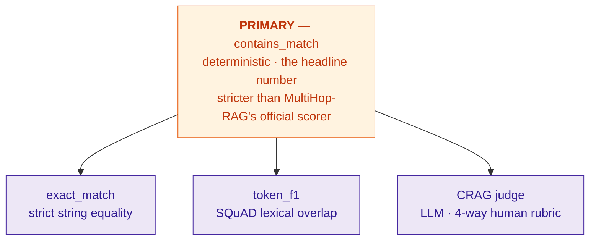
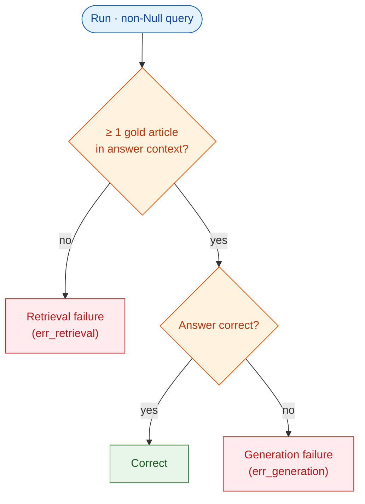

# Chapter 4 — Results (SCAFFOLD)

> **This is a scaffold, not a draft.** The frozen 4×3 matrix has not been run, so there are no
> numbers yet — and none are invented here. Every table is a shell with `[INSERT …]` cells; every
> figure is a placeholder naming the exact notebook cell that produces it; every paragraph is a
> *template* with the interpretation written conditionally ("if X > Y, then …") so that once you run
> the matrix and `export`, you fill blanks rather than write from scratch.
>
> **To populate this chapter, run (your environment):**
> 1. `alembic upgrade head`
> 2. the matrix — all 12, each prefixed `GIT_SHA=$(git rev-parse HEAD)`, on **one** image build,
>    over **one** fixed seeded stratified sample (audit P1/P2).
> 3. `compute-metrics --experiment N` (each) → populates accuracy, Token F1, cost, `pct_failed`.
> 4. `judge --experiment N` (each, fixed `JUDGE_MODEL`) → CRAG.
> 5. run `notebooks/analysis.py` → produces figures F1–F4 / tables from cells N1–N5.
> 6. `export --experiment N` → JSON to paste numbers from.
>
> Then hand me the exports and I'll write the real prose into this skeleton.

Marking hook: **Analysis of findings is the highest-weighted criterion (/30).** Each section below is
already mapped to one research question and one implemented notebook cell, so the analysis is wired to
evidence, not assertion.

---

## 4.1 Overview of the executed matrix

State, in one short paragraph, exactly what was run, so the chapter's comparability rests on recorded
fact rather than claim. Confirm from `experiments.config_json`:

| Provenance field | Value |
|---|---|
| Git SHA (all 12 runs) | `[INSERT — must be identical across runs]` |
| Sample size *N* / seed | `[INSERT]` / `[INSERT]` |
| Stratification | by question type (Inference / Comparison / Temporal / Null) |
| Identical `query_ids` across all 12 | `[INSERT: confirmed yes/no]` |
| Image build / LiteLLM version | `[INSERT]` |
| Hardware (CPU / RAM) | `[INSERT — P3]` |

> Template sentence: "All twelve configurations were evaluated against an identical, seeded
> stratified sample of *N* = `[INSERT]` MultiHop-RAG questions at commit `[INSERT]`, confirming the
> single-sample comparability invariant (§3.6)."

---

## 4.2 Accuracy by orchestration strategy and question type — RQ1

*Evidence: `compute-metrics` (containment primary); `metrics-by-type` / N2.*

**Table 4.1 — Containment accuracy, 4 systems × 3 models.**

| System | Haiku 4.5 | Nova Lite | Qwen3 | Row mean |
|---|---|---|---|---|
| A (naive)     | `[INSERT]` | `[INSERT]` | `[INSERT]` | `[INSERT]` |
| B (iterative) | `[INSERT]` | `[INSERT]` | `[INSERT]` | `[INSERT]` |
| F (decompose) | `[INSERT]` | `[INSERT]` | `[INSERT]` | `[INSERT]` |
| F-tuned       | `[INSERT]` | `[INSERT]` | `[INSERT]` | `[INSERT]` |

**Table 4.2 — Accuracy by question type** (pick the most-discussed model, or report all three in an
appendix table):

| System | Inference | Comparison | Temporal | Null | Overall |
|---|---|---|---|---|---|
| A | `[INSERT]` | `[INSERT]` | `[INSERT]` | `[INSERT]` | `[INSERT]` |
| B | `[INSERT]` | `[INSERT]` | `[INSERT]` | `[INSERT]` | `[INSERT]` |
| F | `[INSERT]` | `[INSERT]` | `[INSERT]` | `[INSERT]` | `[INSERT]` |
| F-tuned | `[INSERT]` | `[INSERT]` | `[INSERT]` | `[INSERT]` | `[INSERT]` |

**Figure 4.1** — grouped bar chart, accuracy by system grouped by question type.

**Analysis template (~400 words).** Anchor every claim to the A/B/F single-variable contrast (§3.2):
- *Decomposition effect (F vs A):* "Decomposition changed accuracy by `[INSERT Δ]` points
  (`[INSERT A]` → `[INSERT F]`). As retriever, generator and context budget are held constant, this
  isolates the decomposition lever." If F > A, relate the gain to Ammann et al.'s reported
  MRR@10 +36.7% / F1 +11.6% (note: different stack — see §3.3, *not* a replication). If F ≈ A,
  discuss whether the budget model's decompositions were lower-quality than Qwen-32B's.
- *Iteration effect (B vs A):* "Iterative reformulation changed accuracy by `[INSERT Δ]`." Tie to the
  IRCoT/Iter-RetGen family; note the ≤5-step budget and budget-model setting.
- *B vs F:* the cleanest sentence in the chapter — sequential conditioned reformulation vs parallel
  upfront decomposition, all else equal. State which wins and by how much.
- *Question type:* expect Comparison/Temporal (multi-hop) to benefit most from B/F; expect **Null**
  to be where over-answering shows — if B/F drop on Null vs A, that is the over-answering finding
  (cf. RAG-vs-GraphRAG: graph/iterative retrieval over-answers nulls, `RELATED_WORK.md §2`).
- *F-tuned:* report as the engineering ceiling; do **not** read its margin as a single-lever effect.

---

## 4.3 Answer-quality metrics and the metric audit — A4 / O6

*Evidence: `compute-metrics` (`avg_token_f1`, `accuracy_exact`, `crag_score`); N4 agreement matrix.*

*Figure 4.2a — The correctness-metric pyramid: one deterministic primary plus three secondaries. §4.3 measures how often they agree (the divergence audit, A4).*

**Table 4.3 — Answer-quality metrics** (one model, or appendix the rest):

| System | Contains (primary) | Exact match | Token F1 | CRAG score |
|---|---|---|---|---|
| A | `[INSERT]` | `[INSERT]` | `[INSERT]` | `[INSERT]` |
| B | `[INSERT]` | `[INSERT]` | `[INSERT]` | `[INSERT]` |
| F | `[INSERT]` | `[INSERT]` | `[INSERT]` | `[INSERT]` |
| F-tuned | `[INSERT]` | `[INSERT]` | `[INSERT]` | `[INSERT]` |

**Figure 4.2** — metric-agreement heatmap (N4 `agree_mat`): pairwise agreement over
contains / exact / tokenF1≥0.5 / CRAG-good.

**Analysis template (~350 words).** This is the **metric-divergence audit (A4)** — the only aim with
zero implementation at audit time, so flag it as a contribution.
- "The four correctness metrics agreed on `[INSERT %]` of runs; the largest divergence was between
  `[INSERT pair]` at `[INSERT %]`." Interpret: where containment and exact-match diverge, answers are
  *correct but verbose*; where containment and Token F1 diverge, partial lexical overlap; where the
  CRAG judge diverges from all deterministic metrics, semantic-but-not-lexical correctness (or judge
  noise).
- Use this to **defend the choice of containment as primary** (§3.7): it is stricter than the
  official MultiHop-RAG scorer, so reported accuracy is conservative.
- Note any system whose ranking *changes* under different metrics — that instability is itself a
  finding about metric choice in RAG evaluation.

---

## 4.4 Cost and latency — RQ2

*Evidence: N2 `variance_tbl` (cost mean/std/total/per-correct, latency p50/p95/mean/std);
N5 `fig_pareto`.*

**Table 4.4 — Cost.**

| System × Model | Total cost (USD) | Cost/query | **Cost per correct** | Tokens in/out | Avg steps |
|---|---|---|---|---|---|
| `[INSERT rows: 12 configs]` | | | | | |

**Figure 4.3** — Pareto frontier (N5): accuracy (x) vs cost-per-correct (y), non-dominated points
marked. **The headline cost figure of the dissertation.**

**Table 4.5 — Latency** (p50 / p95 / mean), per system:

| System × Model | p50 (ms) | p95 (ms) | mean (ms) |
|---|---|---|---|
| `[INSERT]` | | | |

**Analysis template (~400 words).**
- *Cost-per-correct (the contribution):* "A answered each correct question for `[INSERT $]`; B for
  `[INSERT $]` (`[INSERT ×]` more); F for `[INSERT $]`." Connect to Gap 2 — no surveyed paper reports
  cost-per-correct (`RELATED_WORK.md §6`). The HippoRAG $0.10-vs-IRCoT-$1–3 precedent is the only
  comparable dollar figure; cite it as context, not a competitor.
- *Pareto frontier:* name which configurations are non-dominated. Typical expectation: A is on the
  frontier (cheap, decent); F-tuned may be on it (accurate, costly); B is at risk of being *dominated*
  (extra LLM calls per step without proportional accuracy) — if so, that is a clean RQ2 result.
- *Does iteration/decomposition pay for itself?* The core RQ2 sentence: per extra accuracy point,
  `[INSERT $]` for B vs `[INSERT $]` for F.
- *Latency:* report p50/p95. **Scope the cross-provider claim (W9):** the three models run on
  different serving infrastructure and the systems ran sequentially, so cross-*model* latency carries
  a confound; cross-*system* latency within one model is the cleaner comparison.

---

## 4.5 Retrieval ceiling and failure attribution — A4 / O6

*Evidence: N3 `ceiling` + stacked-bar. Null-type queries excluded (no gold).*

*Figure 4.4a — Failure-attribution logic (N3). Every non-Null run lands in exactly one leaf, so `err_retrieval + err_generation = 1 − accuracy` — partitioning each system's errors into "couldn't find the evidence" vs "had it, still wrong".*

**Figure 4.4** — per system: coverage (fraction with ≥1 gold article in the answering context = the
ceiling) and, for each error, the split `err_retrieval` (no evidence retrieved) vs `err_generation`
(evidence present, still wrong). By construction `err_retrieval + err_generation = 1 − accuracy`.

**Table 4.6 — Failure attribution.**

| System | Coverage (ceiling) | Accuracy | Retrieval failures | Generation failures |
|---|---|---|---|---|
| A | `[INSERT]` | `[INSERT]` | `[INSERT]` | `[INSERT]` |
| B | `[INSERT]` | `[INSERT]` | `[INSERT]` | `[INSERT]` |
| F | `[INSERT]` | `[INSERT]` | `[INSERT]` | `[INSERT]` |
| F-tuned | `[INSERT]` | `[INSERT]` | `[INSERT]` | `[INSERT]` |

**Analysis template (~350 words).**
- "The retrieval ceiling for A was `[INSERT %]`; orchestration lifted coverage to `[INSERT %]` (B) and
  `[INSERT %]` (F), confirming that the extra retrievals surface gold evidence the single pass missed
  — *or* did not, if coverage is flat." This directly tests *why* B/F help (or don't): more evidence
  retrieved, vs better use of the same evidence.
- Decompose each system's error budget: a system can be limited by **retrieval** (can't find
  evidence) or **generation** (has evidence, answers wrong). State which bound dominates each system —
  this is the failure-attribution contribution (O6).
- Anchor to the benchmark ceiling: Tang & Yang report GPT-4 at 0.56 accuracy with retrieved chunks
  vs 0.89 with gold evidence ⚠ (re-check Table 6 before printing) — the macro analogue of this
  per-system ceiling.
- Caveat to disclose: coverage uses each run's persisted answering context, whose size differs by
  system; for System B this is "evidence in the answering context", not "ever seen" (the latter would
  use `all_retrieved_chunk_ids`).

---

## 4.6 Cross-model rank stability — RQ3 / RQ4

*Evidence: N1 `kendall_tau_b` (rank stability across models); N2 bootstrap CIs.*

**Table 4.7 — System ranking per model + stability.**

| Rank | Haiku 4.5 | Nova Lite | Qwen3 |
|---|---|---|---|
| 1 | `[INSERT]` | `[INSERT]` | `[INSERT]` |
| 2 | `[INSERT]` | `[INSERT]` | `[INSERT]` |
| 3 | `[INSERT]` | `[INSERT]` | `[INSERT]` |
| 4 | `[INSERT]` | `[INSERT]` | `[INSERT]` |

Kendall τ-b (pairwise across models): `[INSERT]`. Bootstrap 95% CIs on per-system accuracy:
`[INSERT]`.

**Analysis template (~250 words).**
- *Predictability (RQ4):* "The system ranking was `[stable / unstable]` across the three models
  (Kendall τ-b = `[INSERT]`)." If stable, the orchestration ranking generalises across budget models —
  a useful, deployable conclusion. If unstable, orchestration choice is model-dependent — equally
  interesting, and a caution against single-model RAG benchmarking.
- *Overlap of CIs:* where bootstrap CIs overlap, differences are not statistically separable — say so;
  this exceeds the field norm, which spot-checks show is single-run with no CIs (`RELATED_WORK.md §5`).
- Hold the **W6 scope**: heterogeneous *budget-class* models, not a capability axis.

---

## 4.7 Summary of findings

One line per research question (fill after the sections above):
- **RQ1 (accuracy by orchestration + type):** `[INSERT one-sentence answer]`
- **RQ2 (cost per correct + latency):** `[INSERT]`
- **RQ3 (ranking across models):** `[INSERT]`
- **RQ4 (predictability / rank stability):** `[INSERT]`

> These feed directly into Chapter 5's per-RQ conclusions (marking: Conclusions /20 — link back to
> *every* RQ).

---

## Figure/table → notebook-cell index (for when you populate)

| Artefact | Source |
|---|---|
| T4.1, T4.2 accuracy | `compute-metrics`, `metrics-by-type` |
| F4.1 accuracy bars | N2 / by-type |
| T4.3 quality, F4.2 agreement | `compute-metrics`, N4 `agree_mat` |
| T4.4/T4.5 cost+latency, F4.3 Pareto | N2 `variance_tbl`, N5 `fig_pareto` |
| F4.4 / T4.6 ceiling | N3 `ceiling` |
| T4.7 rank stability | N1 `kendall_tau_b`, N2 CIs |
