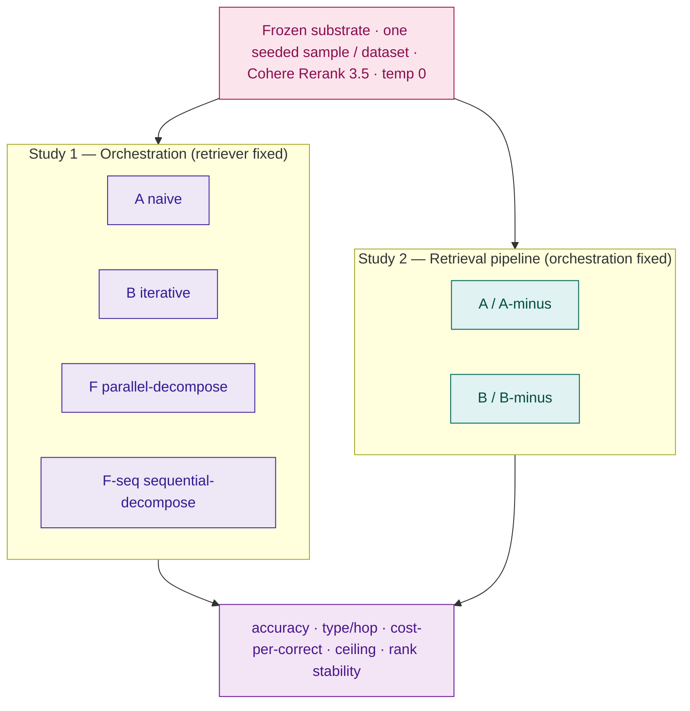
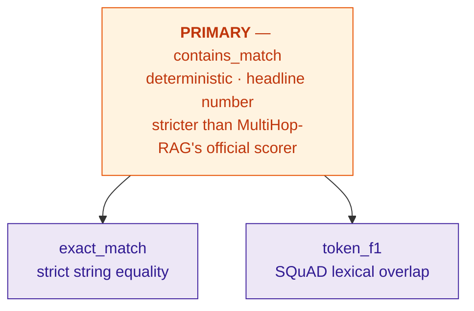

# Chapter 4 — Results

> **Status: scaffold + pilot evidence.** The frozen final matrix (Qwen3-32B · DeepSeek-V3 · Nova Lite,
> over MuSiQue + MultiHop-RAG) has **not** been run, so the headline tables are `[INSERT …]` shells.
> Where this session produced **real pilot runs** (DeepSeek-V3, *n*=50, exp36–43), those numbers are
> shown in clearly-labelled **Pilot** boxes — they are measured, not invented, and they motivate the
> design; the frozen matrix supersedes them. No number outside a Pilot box is invented.
>
> **To populate the final tables (your environment):**
> 1. `alembic upgrade head`
> 2. the frozen matrix (Study 1 + Study 2 below), each run prefixed `GIT_SHA=$(git rev-parse HEAD)`,
>    on **one** image build, over **one** seeded stratified sample per dataset, Cohere Rerank 3.5.
> 3. `compute-metrics --experiment N` (each) → accuracy, Token F1, cost, `pct_failed`.
> 4. `metrics-by-type --experiment N` → per question-type / per hop-count.
> 5. `notebooks/analysis.py` → figures F1–F5 from cells N1–N5.
> 6. `export --experiment N` → JSON to paste from.

**Marking hook: analysis of findings is the highest-weighted criterion (/30).** Every section is mapped
to one research question and one notebook cell, so analysis is wired to evidence, not assertion.

---

## 4.1 Overview of the executed evaluation

The evaluation comprises **two studies over one frozen substrate**, reported separately because they
manipulate different variables:

- **Study 1 — Orchestration** (RQ1–RQ4). The retriever is held constant (hybrid BM25+dense+RRF+rerank);
  the four orchestration strategies **A, B, F, F-seq** vary only in *how queries are produced and
  fused*. Run across three models and both datasets.
- **Study 2 — Retrieval pipeline** (the study's novel contribution). Orchestration is held at its two
  simplest forms (naive, iterative) and the *retriever* is varied: full hybrid+rerank vs dense-kNN-only.
  The dense-only "-minus" twin of every orchestration (A/B/F/F-seq), run on both datasets, forms a
  4×2 factorial that isolates the value of the retrieval pipeline and its interaction with orchestration.

**System nomenclature (codes in tables; full names in prose — see Table 3.1):**
**A** = Single-pass RAG · **B** = Iterative RAG · **F** = Parallel decomposition · **F-seq** =
Sequential decomposition (Self-Ask). Each has a dense-kNN-only twin — **A-minus / B-minus / F-minus /
F-seq-minus** — forming a full 4×2 retrieval×orchestration factorial. The hybrid retriever is the
default; only dense-only rows are tagged.

*Figure 4.0 — Two studies on one substrate: Study 1 varies orchestration with the retriever fixed; Study 2 varies the retriever with orchestration fixed.*

**Provenance (confirm from `experiments.config_json`):**

| Field | Value |
|---|---|
| Git SHA (all runs) | `[INSERT — identical across runs]` |
| Models | Qwen3-32B · DeepSeek-V3 · Nova Lite (all AWS Bedrock, LiteLLM SDK, temp 0) |
| Datasets / *N* / seed | MuSiQue `[INSERT N]` · MultiHop-RAG `[INSERT N]` / `[INSERT seed]` |
| Reranker | Cohere Rerank 3.5 via Bedrock (`cohere.rerank-v3-5:0`, eu-central-1) |
| Answer-context budget | 20 chunks, **uniform across all systems** (`top_k = 20` for A/A-minus; `fused_answer_top_k = 20` for B/F/F-seq) |
| Identical `query_ids` per dataset across all cells | `[INSERT: confirmed yes/no]` |
| Hardware (CPU/RAM) | `[INSERT — P3]` |

> Template sentence: "All configurations were evaluated against an identical seeded stratified sample
> per dataset (MuSiQue *N* = `[INSERT]`; MultiHop-RAG *N* = `[INSERT]`) at commit `[INSERT]`, with the
> retrieval substrate, answer-context budget and prompts held constant (§3)."

**A note on the model panel (RQ3/RQ4 scope).** The three models are heterogeneous *cost-efficient*
models spanning a real capability gradient — Nova Lite (weak) < Qwen3-32B (mid) < DeepSeek-V3
(strong-but-cheap) — not a frontier panel; cross-model claims are framed accordingly (§3.5). One
panel property is itself a result: **Nova Lite cannot run the decomposition systems** — its
structured-output decoder parse-fails, so F/F-seq degrade to naive retrieval (avg ~1.1 vs 3.5–3.7
retrievals). All three models run all eight systems (symmetric matrix); Nova's F-family cells are
reported explicitly as this degradation — they approximate Nova's own System A, not genuine
decomposition — and constitute the orchestration-robustness finding (§4.6).

---

## 4.2 Study 1 — Accuracy by orchestration strategy — RQ1

*Evidence: `compute-metrics` (containment primary); `metrics-by-type`; N2.*

**Table 4.1 — Containment accuracy, 4 strategies × 3 models, per dataset.** (Nova F/F-seq marked † =
decompose parse-fails → degraded to naive, so these ≈ Nova A; see §4.6.)

| System | \multicolumn — DeepSeek-V3 | Qwen3-32B | Nova Lite |
|---|---|---|---|
| A (naive) | `[INSERT]` | `[INSERT]` | `[INSERT]` |
| B (iterative) | `[INSERT]` | `[INSERT]` | `[INSERT]` |
| F (parallel decomp.) | `[INSERT]` | `[INSERT]` | `[INSERT]` † |
| F-seq (sequential decomp.) | `[INSERT]` | `[INSERT]` | `[INSERT]` † |

*(Produce one Table 4.1 per dataset — MuSiQue and MultiHop-RAG — or stack them.)*

> **Pilot — MuSiQue, DeepSeek-V3, n=50 (exp38; supersedes none, motivates the design):**
> A 0.380 · B 0.540 · F 0.400 · **F-seq 0.540**. Iteration and sequential decomposition tie at the
> top; parallel decomposition (F) barely improves on naive (A).

**Table 4.2 — Accuracy by hop count (MuSiQue) / question type (MultiHop)**, most-discussed model:

| System | 2-hop | 3-hop | 4-hop | Overall |
|---|---|---|---|---|
| A | `[INSERT]` | `[INSERT]` | `[INSERT]` | `[INSERT]` |
| B | `[INSERT]` | `[INSERT]` | `[INSERT]` | `[INSERT]` |
| F | `[INSERT]` | `[INSERT]` | `[INSERT]` | `[INSERT]` |
| F-seq | `[INSERT]` | `[INSERT]` | `[INSERT]` | `[INSERT]` |

> **Pilot — MuSiQue by hop, DeepSeek-V3, n=50 (exp38):**
> | | 2-hop | 3-hop | 4-hop |
> |---|---|---|---|
> | A | 0.462 | 0.333 | 0.222 |
> | B | **0.615** | 0.533 | 0.333 |
> | F | 0.462 | 0.467 | 0.111 |
> | F-seq | 0.538 | **0.600** | **0.444** |
> F-seq is strongest on the deep hops (3-/4-hop); B leads 2-hop; F collapses on 4-hop.

**Figure 4.1** — grouped bar chart, accuracy by system grouped by hop/type (N2 / by-type).

**Analysis template (~450 words).** Anchor every claim to the single-variable contrasts (§3.2):

- *Decomposition effect (F vs A):* "Parallel decomposition changed accuracy by `[INSERT Δ]`
  (`[A]`→`[F]`)." If F ≈ A (as in the pilot), interpret via the bridge problem: F issues bridge
  sub-questions ("the spouse of *that director*") blind, so later-hop retrievals are weak — relate to
  Ammann et al.'s stated single-shot limitation (`RELATED_WORK.md §2`).
- *Sequential vs parallel decomposition (F-seq vs F) — the decomposition carve-out:* "Resolving hops
  sequentially changed accuracy by `[INSERT Δ]` over parallel F, and by `[INSERT Δ]` on 4-hop
  questions." This is the cleanest novel contrast in Study 1 (Press et al. self-ask; Zhou et al.
  least-to-most). State the hop-count interaction: sequential resolution should help *more* as hop
  depth grows, because each bridge entity is resolved before the next retrieval.
- *Iteration effect (B vs A):* tie to IRCoT/Iter-RetGen; note the ≤5-step budget.
- *B vs F-seq:* free-form iterative reformulation vs pre-planned self-ask — both resolve bridges, one
  adaptively, one by decomposition. State which wins overall and per hop, and at what cost (§4.5).
- *Null / over-answering (MultiHop):* if B/F/F-seq drop on Null vs A, that is the over-answering
  finding (cf. RAG-vs-GraphRAG, `RELATED_WORK.md §2`).

---

## 4.3 Study 2 — The retrieval pipeline and its interaction with orchestration (novel contribution)

*Evidence: `compute-metrics`; N3 ceiling. The 4×2 of retriever {hybrid+rerank, semantic-only} ×
orchestration {naive, iterative}.*

This study isolates the value of the hybrid+rerank pipeline by comparing each orchestration to its
semantic-kNN-only twin (A-minus, B-minus, F-minus, F-seq-minus), on both datasets — a full 4×2
factorial. It is the study's distinctive result: **the value of the retrieval pipeline is
dataset-dependent and interacts with orchestration.**

**Table 4.3 — Retriever × orchestration 4×2 (containment accuracy), per dataset, per model.**

| Orchestration | hybrid+rerank | dense-only | Δ (dense − hybrid) |
|---|---|---|---|
| naive (A / A-minus) | `[INSERT]` | `[INSERT]` | `[INSERT]` |
| iterative (B / B-minus) | `[INSERT]` | `[INSERT]` | `[INSERT]` |
| parallel decomp. (F / F-minus) | `[INSERT]` | `[INSERT]` | `[INSERT]` |
| sequential decomp. (F-seq / F-seq-minus) | `[INSERT]` | `[INSERT]` | `[INSERT]` |

> **Pilot — DeepSeek-V3, n=50 (exp38/41/42/43):**
> | Dataset | A (hybrid) | A-minus (sem.) | B (hybrid) | B-minus (sem.) |
> |---|---|---|---|---|
> | **MultiHop-RAG** (news) | **0.800** | 0.600 | — | — |
> | **MuSiQue** (anti-shortcut) | 0.380 | 0.420 | 0.540 | **0.640** |
>
> On news the pipeline is worth **+0.20** (A vs A-minus); on MuSiQue it is flat-to-negative, and
> **dense-only + iteration (B-minus 0.640) is the best system on MuSiQue**. The semantic−hybrid gap
> *widens* with iteration (+0.04 naive → +0.10 iterative).
> The decomposition twins (**F-minus, F-seq-minus**) complete the 4×2 factorial and are filled by the
> final matrix; the open question they answer is whether **dense-only decomposition** beats B-minus on
> MuSiQue — i.e. whether F-seq-minus, not B-minus, is the true MuSiQue champion.

**Figure 4.5** — clustered bars: accuracy by retriever, grouped by dataset, with the naive/iterative
pair side by side. **The figure that carries the novel finding.**

**Analysis template (~400 words).**
- *Dataset-dependence:* "Hybrid+rerank improved naive accuracy by `[INSERT Δ]` on MultiHop-RAG but
  `[INSERT Δ]` on MuSiQue." Ground this in BEIR's domain-dependence of BM25 vs dense
  (`RELATED_WORK.md §8`, Thakur et al. 2021) — no universal best retriever.
- *Mechanism (cite, don't assert):* MuSiQue's hard distractors are **BM25-mined with intermediate
  answers masked** (`RELATED_WORK.md §8`, Trivedi et al. 2022) — the lexical component is adversarial
  *by construction*, so adding BM25+rerank surfaces distractors. State explicitly: the paper supports
  the *premise* (BM25-adversarial distractors); the *conclusion* (dense+iteration wins on answering)
  is this study's contribution. Frame as "on benchmarks whose distractors are BM25-mined," not "all
  adversarial multi-hop."
- *Interaction with orchestration:* "The semantic-over-hybrid advantage grew from `[INSERT]` (naive)
  to `[INSERT]` (iterative)" — iteration compounds the lexical-distractor noise under hybrid but not
  under semantic-only (error-propagation framing, `RELATED_WORK.md §8` ⚠ verify before quoting).
- *Practical takeaway:* a deployable recommendation — match the retriever to the corpus: hybrid+rerank
  on lexically-honest corpora (news), dense + iteration on adversarial multi-hop.

---

## 4.4 Answer-quality metrics and the metric audit — A4 / O6

*Evidence: `compute-metrics` (`avg_token_f1`, `accuracy_exact`); N4 agreement matrix. CRAG judge
omitted by design (secondary; cost-saving) — disclose.*

*Figure 4.2 — Correctness-metric pyramid: one deterministic primary plus two lexical secondaries. §4.4 measures how often they agree (divergence audit, A4). (MuSiQue uses `answer_match` — containment plus aliases and bidirectional terse-answer matching.)*

**Table 4.4 — Answer-quality metrics** (one model/dataset; appendix the rest):

| System | Contains (primary) | Exact match | Token F1 |
|---|---|---|---|
| A | `[INSERT]` | `[INSERT]` | `[INSERT]` |
| B | `[INSERT]` | `[INSERT]` | `[INSERT]` |
| F | `[INSERT]` | `[INSERT]` | `[INSERT]` |
| F-seq | `[INSERT]` | `[INSERT]` | `[INSERT]` |

**Figure 4.3** — metric-agreement heatmap (N4): pairwise agreement over contains / exact / tokenF1≥0.5.

**Analysis template (~300 words).** This is the metric-divergence audit (A4): report agreement %,
the largest divergent pair, and interpret (contains vs exact = correct-but-verbose; contains vs Token
F1 = partial lexical overlap). Use it to **defend containment as primary** — it is stricter than the
official MultiHop-RAG word-intersection scorer (`RELATED_WORK.md §5`), so reported accuracy is
conservative. Flag any system whose ranking changes under a different metric.

---

## 4.5 Cost and latency — RQ2

*Evidence: N2 `variance_tbl`; N5 `fig_pareto`. Costs are billed Bedrock figures
(`response_cost`, LLM only); the embedder is free CPU, and the Cohere reranker is a metered Bedrock
call **not** captured in `cost_usd` (borne by hybrid systems only) — reported separately.*

**Table 4.5 — Cost, per system × model (both datasets pooled or split).**

| System × Model | Total cost (USD) | Cost/query | **Cost per correct** | Avg steps |
|---|---|---|---|---|
| `[INSERT rows]` | | | | |

> **Pilot — measured cost/query, DeepSeek-V3 (the cost basis for the matrix):**
> A $0.0017 · A-minus $0.0017 · F $0.0026 · F-seq $0.0038 · B $0.0068 · B-minus $0.0065.
> B is ~4× A (it issues ~4 retrieval+route calls); decomposition (F/F-seq) sits between. Haiku ≈ 7–8×
> these figures; Nova ≈ 1/14.

**Figure 4.4** — Pareto frontier (N5): accuracy (x) vs cost-per-correct (y), non-dominated points
marked. **The headline cost figure.**

**Analysis template (~400 words).**
- *Cost-per-correct (the contribution):* "A answered each correct question for `[INSERT $]`; B for
  `[INSERT $]` (`[INSERT ×]` more); F-seq for `[INSERT $]`." Connect to Gap 2 — no surveyed paper
  reports cost-per-correct (`RELATED_WORK.md §6`); HippoRAG's $0.10-vs-IRCoT-$1–3 is the only dollar
  precedent, cited as context.
- *Pareto frontier:* name the non-dominated configs. Likely: A/A-minus cheap-and-decent; B accurate
  but dominated where its extra calls don't pay; F-seq the multi-hop value pick if it lands on the
  frontier. **On MuSiQue specifically, B-minus may dominate** (best accuracy *and* no rerank cost).
- *Does orchestration pay for itself?* dollars per extra accuracy point, B vs F-seq.
- *Latency (W9 scope):* report p50/p95 per system; cross-*model* latency carries a serving-infra
  confound (sequential runs), so the clean comparison is cross-*system within one model*.

---

## 4.6 Cross-model rank stability and orchestration robustness — RQ3 / RQ4

*Evidence: N1 `kendall_tau_b`; N2 bootstrap CIs.*

**Table 4.6 — System ranking per model + stability.**

| Rank | DeepSeek-V3 | Qwen3-32B | Nova Lite |
|---|---|---|---|
| 1 | `[INSERT]` | `[INSERT]` | `[INSERT]` |
| 2 | `[INSERT]` | `[INSERT]` | `[INSERT]` |
| 3 | `[INSERT]` | `[INSERT]` | `[INSERT]` |
| 4 | `[INSERT]` | `[INSERT]` | `[INSERT]` |

Kendall τ-b across models: `[INSERT]`. Bootstrap 95% CIs on per-system accuracy: `[INSERT]`.

**Analysis template (~300 words).**
- *Predictability (RQ4):* "The ranking was `[stable/unstable]` across models (τ-b = `[INSERT]`)."
  Stable → the orchestration ranking generalises across cost-efficient models (deployable). Unstable →
  orchestration choice is model-dependent (a caution against single-model RAG benchmarking).
- *Orchestration robustness (a distinct RQ4 result):* **Nova Lite could not execute F/F-seq** —
  structured-output parse-failure degraded them to naive retrieval (avg 1.1 vs 3.5–3.7 retrievals on
  DeepSeek/Qwen). State the deployable lesson: *decomposition orchestration presupposes reliable
  structured-output generation; iterative free-text reformulation (B) is the more model-robust
  multi-hop strategy.* This connects to the System B routing redesign (§3.3) that fixed the same
  fragility for B.
- *CIs:* where bootstrap CIs overlap, differences are not statistically separable — say so (exceeds
  the field's single-run norm, `RELATED_WORK.md §5`). With *n*≈150 the small-sample noise of the
  pilots (2–5 query swings) is materially reduced — state the *n* explicitly.
- *Scope (W6):* heterogeneous *cost-efficient* models with a capability gradient, not a frontier axis.

---

## 4.7 Summary of findings

One line per research question (fill after the sections above):
- **RQ1 (accuracy by orchestration + type/hop):** `[INSERT]` — e.g. sequential decomposition (F-seq)
  and iteration (B) lead on deep multi-hop; parallel decomposition (F) ≈ naive.
- **RQ2 (cost per correct + latency):** `[INSERT]` — the Pareto-frontier configs.
- **RQ3 (ranking across models):** `[INSERT]` — rank (in)stability across the capability gradient.
- **RQ4 (predictability / robustness):** `[INSERT]` — rank stability + the Nova decomposition-failure
  robustness result.
- **Novel — retriever × orchestration:** `[INSERT]` — pipeline value is dataset-dependent (hybrid wins
  on news; dense+iteration wins on MuSiQue).

> These feed Chapter 5's per-RQ conclusions (Conclusions /20 — link back to *every* RQ, including the
> retriever finding).

---

## Figure/table → notebook-cell index (for when you populate)

| Artefact | Source |
|---|---|
| T4.1/T4.2 accuracy, F4.1 bars | `compute-metrics`, `metrics-by-type`, N2 |
| T4.3 / F4.5 retriever×orchestration 4×2 | `compute-metrics` (all 8 cells: X / X-minus) |
| T4.4 quality, F4.3 agreement | `compute-metrics`, N4 `agree_mat` |
| T4.5 cost, F4.4 Pareto | N2 `variance_tbl`, N5 `fig_pareto` |
| T4.6 rank stability | N1 `kendall_tau_b`, N2 CIs |
| Retrieval ceiling (optional §4.3 sub) | N3 `ceiling` (uses `all_retrieved_chunk_ids`) |
